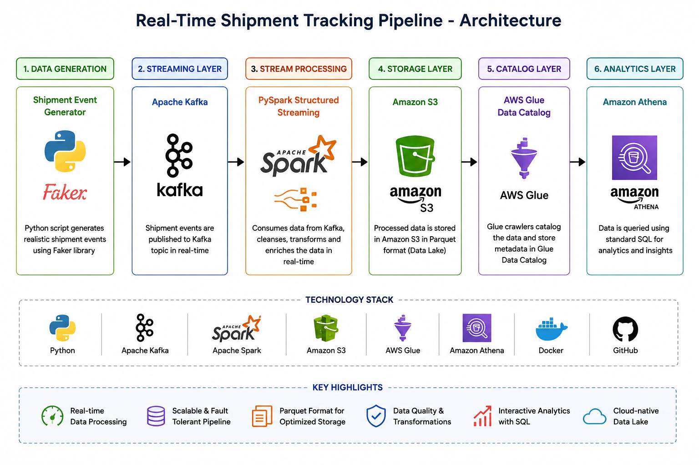

# 🚚 Real-Time Shipment Tracking Pipeline

> An end-to-end real-time data engineering pipeline that streams shipment events using Apache Kafka, processes them with PySpark Structured Streaming, stores optimized Parquet files in Amazon S3, and enables serverless analytics using Amazon Athena.

---

## 📖 Overview

This project simulates a real-world logistics system where shipment events are continuously generated, streamed, processed, and stored for analytical querying.

The pipeline demonstrates how modern data engineering technologies work together to build scalable streaming applications.

---

# 🏗️ Architecture

## 🏗️ Architecture



---

# 🔄 Pipeline Workflow

```text
                📦 Shipment Generator
                (Python + Faker)
                       │
                       ▼
              🚀 Apache Kafka
                       │
                       ▼
       ⚡ PySpark Structured Streaming
                       │
       Data Cleaning & Transformation
                       │
                       ▼
        🗂️ Amazon S3 (Parquet Files)
                       │
                       ▼
          📚 AWS Glue Data Catalog
                       │
                       ▼
            🔍 Amazon Athena
                       │
                       ▼
            📊 SQL Analytics
```

---

# 🚀 Tech Stack

| Category | Technologies |
|----------|--------------|
| Programming Language | Python |
| Streaming Platform | Apache Kafka |
| Processing Engine | Apache Spark Structured Streaming |
| Cloud Storage | Amazon S3 |
| Metadata Catalog | AWS Glue Data Catalog |
| Query Engine | Amazon Athena |
| Storage Format | Apache Parquet |
| Containerization | Docker & Docker Compose |
| Data Generation | Faker |
| Version Control | Git & GitHub |

---

# ✨ Key Features

- 📦 Real-time shipment event generation
- 🚀 Kafka-based message streaming
- ⚡ Stream processing using PySpark Structured Streaming
- 🧹 Data cleaning and validation
- 🔄 Duplicate record removal
- ⏰ Shipment age calculation
- 🚚 Delayed shipment identification
- 💾 Parquet storage optimization
- ☁️ Amazon S3 Data Lake
- 🔍 Interactive SQL analytics with Amazon Athena
- 🐳 Dockerized development environment

---

# ▶️ Getting Started

## 1️⃣ Clone Repository

```bash
git clone https://github.com/DeeptiSahu30/Real-time-shipment-pipeline.git
```

---

## 2️⃣ Start Docker Services

```bash
cd docker

docker compose up -d
```

---

## 3️⃣ Start Shipment Producer

```bash
python producer/producer.py
```

---

## 4️⃣ Start Spark Consumer

```bash
docker exec -it spark bash

cd /opt/project/spark

/opt/spark/bin/spark-submit \
--packages org.apache.spark:spark-sql-kafka-0-10_2.12:3.5.6,org.apache.hadoop:hadoop-aws:3.3.4,com.amazonaws:aws-java-sdk-bundle:1.12.262 \
consumer.py
```

---

## 5️⃣ Query Using Athena

Execute SQL queries on the **shipment_processed** external table to analyze shipment data.

---

# 🎯 Skills Demonstrated

- Python
- SQL
- Apache Kafka
- Apache Spark Structured Streaming
- ETL Pipeline Development
- Data Validation & Transformation
- Amazon S3
- AWS Glue Data Catalog
- Amazon Athena
- Docker
- Git & GitHub
- Real-Time Data Processing

---

# 📌 Future Enhancements

- Apache Airflow orchestration
- Power BI Dashboard
- Amazon QuickSight Dashboard
- Data Quality Monitoring
- CI/CD using GitHub Actions
- CloudWatch Monitoring

---

# 👩‍💻 Author

**Deepti Sahu**

🐙 GitHub: https://github.com/DeeptiSahu30

